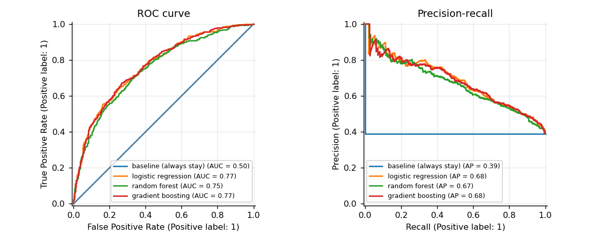
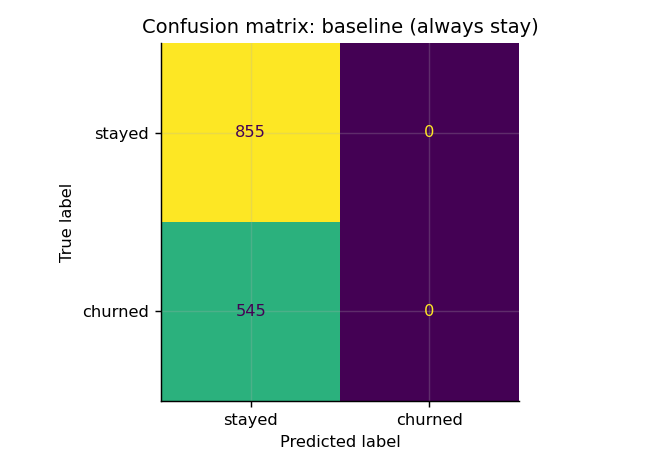
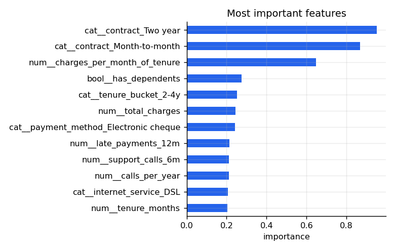

# Customer Churn Prediction

[](https://github.com/umer-78/customer-churn-prediction/actions/workflows/ci.yml)


An end-to-end machine learning project: generate a realistic customer dataset,
engineer features, compare four models on the same split, report honest metrics,
and score new customers from the command line.



## What is in here

| Step | Where |
|---|---|
| Dataset (synthetic, reproducible, with missing values) | [`src/churn/data.py`](src/churn/data.py), [`data/customers.csv`](data/customers.csv) |
| Feature engineering and preprocessing pipeline | [`src/churn/features.py`](src/churn/features.py) |
| Model training, comparison and metrics | [`src/churn/model.py`](src/churn/model.py) |
| Report charts | [`src/churn/plots.py`](src/churn/plots.py), [`reports/`](reports) |
| CLI (`generate`, `summary`, `train`, `predict`) | [`src/churn/cli.py`](src/churn/cli.py) |
| Tests | [`tests/test_churn.py`](tests/test_churn.py) |
| What the model may and may not be used for | [`MODEL_CARD.md`](MODEL_CARD.md) |

## Quick start

```bash
git clone https://github.com/umer-78/customer-churn-prediction.git
cd customer-churn-prediction
python -m venv .venv && source .venv/bin/activate
pip install -e ".[dev]"

churn summary                       # what the data looks like
churn train --cv 5 --charts reports # compare models, save the best
churn predict data/customers.csv --top 10
```

## Results

Held-out 20% test set, 7,000 customers, 38.9% churn rate:

```text
model                  accuracy precision  recall     f1 roc_auc  pr_auc  brier cv_auc
--------------------------------------------------------------------------------------
baseline (always stay)    0.611     0.000   0.000  0.000   0.500   0.389  0.389  0.500
logistic regression       0.688     0.584   0.690  0.632   0.769   0.684  0.196  0.787
random forest             0.685     0.585   0.655  0.618   0.753   0.667  0.198  0.771
gradient boosting         0.718     0.661   0.565  0.609   0.770   0.681  0.187  0.778

best by PR-AUC: logistic regression
```

Reading the table:

- **The baseline** predicts "nobody churns". It still gets 61% accuracy, which is
  why accuracy alone is a bad way to judge this problem.
- **PR-AUC** is the headline number here, because the positive class is the
  minority and the cost of missing a churner is what the business cares about.
- **Brier score** (lower is better) says whether the probabilities can be trusted,
  not just the ranking. That matters if you offer discounts by risk band.
- Logistic regression wins on PR-AUC, gradient boosting on accuracy and Brier.
  With a class-weighted linear model you catch more churners (recall 0.69) at the
  cost of more false alarms.

There is a ceiling: the label is generated with real noise, so no model can pass
roughly 0.80 ROC-AUC on this data. A model that claims 0.99 here is leaking.




## What drives churn in this data

1. **Contract type** — month-to-month customers churn about 2.6× as often as two-year ones
2. **Tenure** — 49.8% in the first six months against 15.2% after four years
3. **Spend per month of tenure**, support calls, late payments and paying by electronic cheque

## About the data

Public churn datasets carry licences that make redistribution awkward, so
`churn generate` builds one instead: 7,000 customers with realistic
distributions, 2% missing values, and a label drawn from a logistic model with
noise. Relationships are the ones a telecom analyst would expect, and the tests
assert that they hold.

**This means the numbers show that the pipeline works, not that it will
generalise to your customers.** Point it at a real export (same columns) and
retrain before believing anything.

## Predicting

```bash
churn predict data/customers.csv -o scored.csv --threshold 0.4
```

```text
5 highest-risk customers:
customer_id  churn_probability risk  predicted_churn
    C000700             0.9875 high                1
    C005185             0.9794 high                1
    C005661             0.9779 high                1
    C001529             0.9767 high                1
    C000651             0.9762 high                1

3,164 of 7,000 flagged at threshold 0.5
```

`risk` buckets the probability into low / medium / high so a retention team can
work the list without reading probabilities.

## Development

```bash
ruff check .
python -m pytest -q      # 13 tests
```

The tests check the data generator's relationships, missing-value handling,
unseen categories, metric arithmetic against hand-computed values, that every
model beats the baseline, and the whole CLI end to end.

## License

[MIT](LICENSE)
